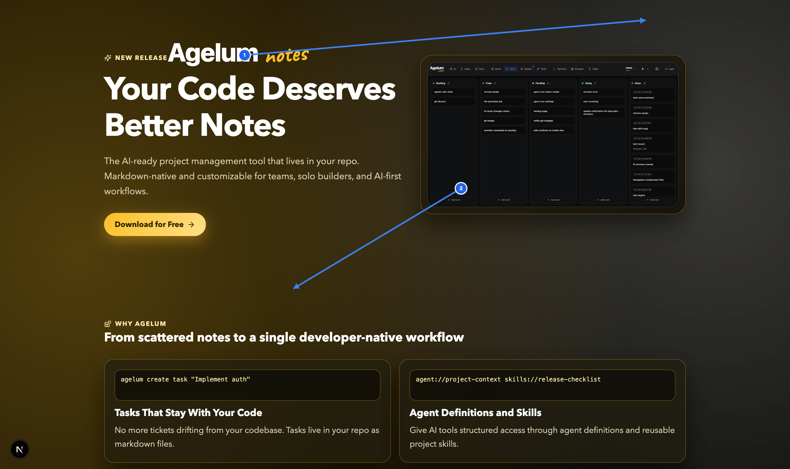

# 26_02_13-185941-UI-Fixes

Source: Browser Screenshot

## Annotations

1. Where is the blue arrow with number 1 we need to move that. lets move the logo to the top right, and also need to respect the original logo as it is in web app, that the word notes is below the word agelum
2. Where is the blue arrow with number 2 we need to move that. lets move the screenshot to the next section to be bigger

